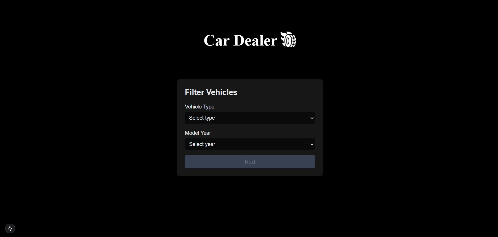
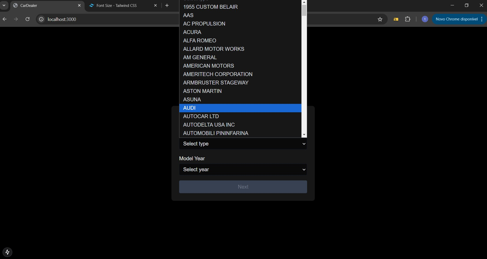
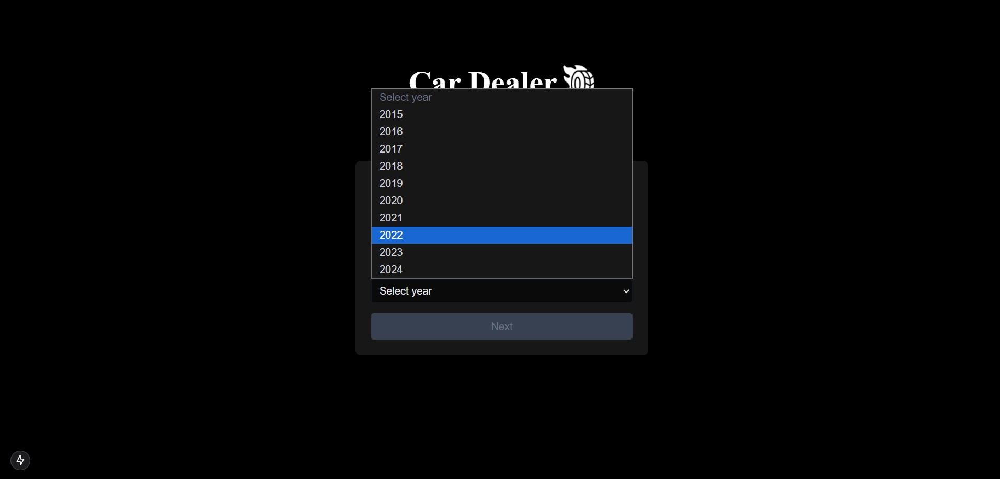
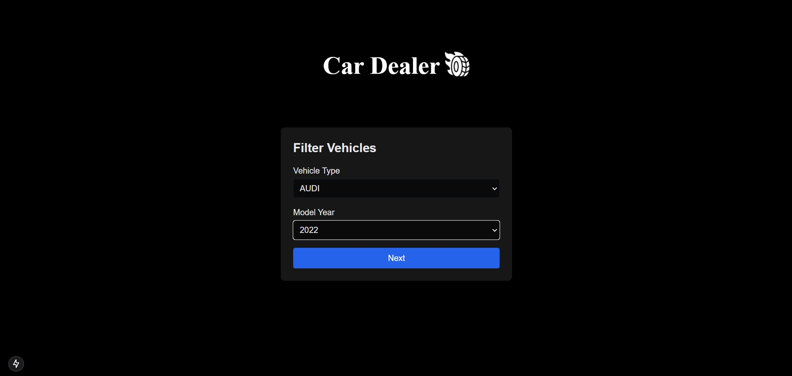
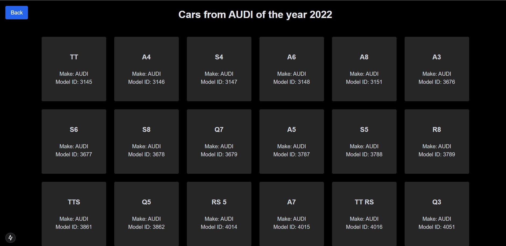
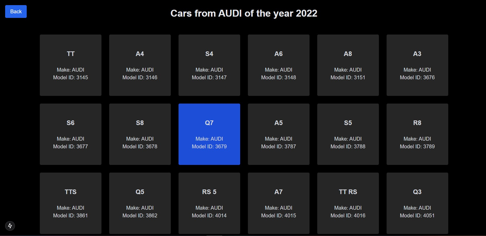
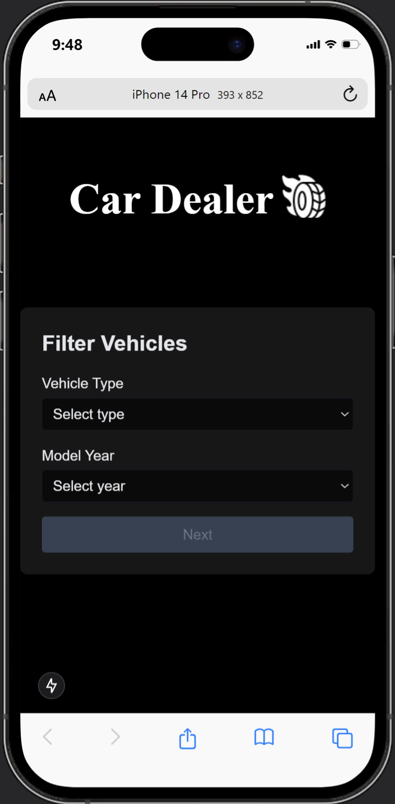
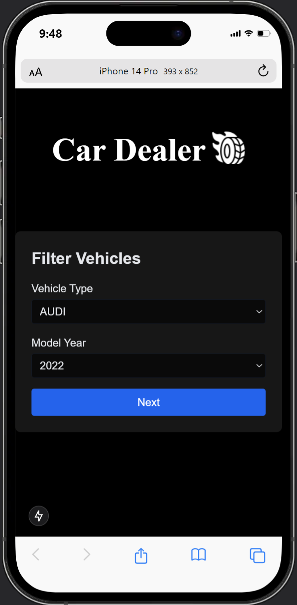

# Car Dealer App








<p align="center">
  
  
</p>

## Overview

The **Car Dealer App** is a Next.js application that allows users to filter vehicles by brand and manufacturing year. The application uses the National Highway Traffic Safety Administration (NHTSA) API to fetch information about vehicle makes and models.

## Features

- Display of a list of vehicle brands.
- Vehicle filtering by brand and year.
- Dynamic data loading using the API.
- Responsive and modern design using Tailwind CSS.

## Architecture

The application is structured as follows:

- **Pages**: Utilizes Next.js page structure with dynamic routes to display search results.
- **Components**: Reusable components for displaying vehicle lists and forms.
- **Styling**: Uses Tailwind CSS for a clean and responsive design.
- **Data**: Connects to an external API to fetch data on vehicle makes and models.

## Instructions to Run the Application

1. **Clone the Repository:**

   ```bash
   git clone https://github.com/seuusuario/car-dealer-app.git
   cd car-dealer-app

## Instructions to Run the Application

2. **Vercel:**

   ```bash
   [cd car-dealer-app](https://car-dealer-c1h2phegn-wryans-projects.vercel.app/)
